# 챗봇 보안 이슈 3건 작업 정리 (2026-09-15)

> 대상: `통합 현황 보고서 09-15.md`에서 챗봇 관련 미해결로 지목된 3가지 항목.
> 작업 방식: TDD(Red → Green → Refactor). 사전 워크플로우는 [`RATE_LIMIT_PROMPT_INJECTION_WORKFLOW.md`](./RATE_LIMIT_PROMPT_INJECTION_WORKFLOW.md) 참고.
> **git 상태: 로컬 작업만 진행, 아직 commit/push 없음.**

---

## 1. 오늘 한 작업 목록과 목적

| # | 문제 | 목적 |
|---|---|---|
| 1 | Rate limit이 병원 전체에 공용으로 걸림 | chatbot-service가 WAS를 거쳐서만 호출되다 보니 모든 요청의 소스 IP가 WAS 서버 하나로 동일 → slowapi 기본 `key_func`(IP 기준)로는 환자 A가 요청을 많이 보내면 환자 B까지 막히는 문제. 이를 **환자 단위**로 버킷을 분리 |
| 2 | `hospital_agent.py` 날짜 파싱 정규식의 ReDoS 위험 | "위험해 보인다"는 정적 판단에 그치지 않고, 실제 악의적 입력으로 서버가 멈추는지 **직접 실행해서 검증** |
| 3 | 프롬프트 인젝션 방어가 LLM 지시문(soft)에만 의존 | "특정 나쁜 문장을 미리 정해서 막는" 방식은 표현만 바꾸면 뚫려 근본 해결이 아님 → ① patient_id가 애초에 LLM/질문 텍스트의 영향을 받지 않는 구조인지 확인·고정, ② 그럼에도 인젝션이 성공해 시스템 프롬프트가 새어나오는 경우를 **출력 쪽에서 결정론적으로 탐지·차단** |

작업 순서: 워크플로우 문서 작성(코드 변경 전 승인) → 문제별 테스트 작성(Red 확인) → 최소 구현(Green) → 중복 제거(Refactor) → 기존 테스트 스위트 재실행으로 회귀 확인.

---

## 2. 변경/추가된 파일

### 신규 파일
- `RATE_LIMIT_PROMPT_INJECTION_WORKFLOW.md` — 코드 변경 전 승인용 워크플로우/설계 문서
- `chatbot-service/rate_limit_key.py` — 환자별 rate limit 키 생성 함수 (app.py의 무거운 import와 분리해 단위 테스트 용이하게 함)
- `chatbot-service/test_rate_limit.py` — 문제 1 테스트 (4건)
- `chatbot-service/test_no_redos.py` — 문제 2 검증 테스트 (2건)
- `chatbot-service/test_prompt_injection.py` — 문제 3 테스트 (4건)
- `CHATBOT_SECURITY_WORK_0915.md` — 본 문서

### 수정 파일
- `chatbot-service/app.py` — `Limiter(key_func=get_remote_address)` → `Limiter(key_func=get_rate_limit_key)`
- `was/routes/chat.js` — `/api/chat` 호출 시 `X-Patient-Id` 헤더 추가 (세션의 `patientId`, 클라이언트 조작 불가)
- `chatbot-service/3-1-llm.py` — `REFUSAL_MESSAGE` 상수, `_contains_system_prompt_leak()` 추가, `generate_answer()`/`generate_direct_answer()` 양쪽에 유출 탐지 적용

### 변경하지 않은 파일 (확인만 함)
- `chatbot-service/hospital_agent.py` — `choose_action()`이 순수 키워드 매칭이라 LLM이 라우팅에 관여하지 않음을 확인, 테스트로 고정만 함

---

## 3. 해결 / 미해결 / 우려 사항

### 해결됨 (Green)
- **문제 1**: `X-Patient-Id` 헤더 기반으로 환자별 rate limit 분리. `/api/chat`은 항상 로그인 필요(`req.session.patientId` 없으면 401)라서 헤더가 비어있는 익명 경로 자체가 없음을 확인.
- **문제 3-a (구조적 안전성)**: `patient_id`는 질문 텍스트가 뭐라고 하든 항상 `run_agent()` 호출자가 넘긴 값으로 고정됨을 회귀 테스트로 잠금.
- **문제 3-b (출력 유출 차단)**: LLM 응답에 시스템 프롬프트 원문이 그대로 포함되면 `REFUSAL_MESSAGE`로 강제 교체. "어떤 표현으로 공격했든 결과가 유출이면 잡는다"는 방식이라 문구 우회에 영향받지 않음.

### 검증 완료 (버그 아니었음, 회귀 방지용으로 테스트만 고정)
- **문제 2**: 100KB~1MB 크기의 적대적 입력(반복 숫자, ISO 포맷 유사 문자열 등)으로 6개 정규식을 실제 실행해 타이밍 측정 → 입력 크기 10배 시 처리 시간도 선형(10배)으로 증가, 지수적 폭증 없음. 게다가 `/api/chat`은 메시지 길이 1000자 제한이 있어 실제 공격 표면은 더 작음. **ReDoS 취약점 아님으로 결론**, 테스트는 회귀 방지 목적으로 유지.

### 미해결 / 보류 (사용자 지시로 홀드)
- **`pii_masking.py`**: 팀원이 `origin/main`에 독립적으로 유사 수정을 올려둔 상태와 로컬 수정본이 충돌. **pull/merge 시도하지 않고 보류 중** — 별도 승인 시 "팀원 버전 기반 재구성 → 로컬 수정 재적용 → 전체 재검증" 절차로 진행 예정.

### 우려 사항 (구조적 한계, 인지만 해둘 것)
- `rate_limit_key.py`의 폴백 로직: `X-Patient-Id` 헤더가 없으면 예전 방식(IP 기준)으로 조용히 되돌아감 — 서비스 전체가 죽는 것보다는 안전하지만, WAS 배포 실수로 헤더가 누락되면 "병원 전체 공용 버킷" 문제가 다시 재현될 수 있음. 현재는 `fallback-ip:` 접두사로 구분만 해둠.
- 시스템 프롬프트 유출 탐지는 "지시문 원문 전체가 그대로 포함"되는 경우만 잡음 — LLM이 지시문을 요약/의역해서 유출하면 탐지 못할 수 있음(다만 이는 원문 그대로 노출되는 것보다 위험도가 낮음).

### 회귀 확인
기존 테스트 `test_shared_vectors.py`(12), `audit-agent/test_masking_secrets.py`(11), `test_audit_notify.py`(5) 전부 재실행 통과. 신규 테스트 10건 포함 총 38건 통과, 실패 없음.

---

## 4. 작업 흐름도

```mermaid
flowchart TD
    subgraph P1["문제 1: Rate Limit 공용 버킷"]
        A1["chat.js<br/>req.session.patientId 확보"] --> A2["X-Patient-Id 헤더 추가<br/>(was/routes/chat.js)"]
        A2 --> A3["chatbot-service/app.py<br/>Limiter key_func 교체"]
        A3 --> A4["rate_limit_key.py<br/>get_rate_limit_key()"]
        A4 --> A5{"헤더 있음?"}
        A5 -->|Yes| A6["patient:{id} 로 분리된 버킷"]
        A5 -->|No 폴백| A7["fallback-ip:{ip} (구식 동작)"]
    end

    subgraph P2["문제 2: ReDoS 검증"]
        B1["hospital_agent.py<br/>날짜 파싱 정규식 6종"] --> B2["test_no_redos.py<br/>100KB~1MB 적대적 입력으로 실행"]
        B2 --> B3["타이밍 측정: 선형 증가 확인"]
        B3 --> B4["결론: 취약점 아님<br/>테스트는 회귀 가드로 유지"]
    end

    subgraph P3["문제 3: 프롬프트 인젝션"]
        C1["사용자 질문 텍스트"] --> C2["hospital_agent.choose_action()<br/>순수 키워드 매칭 (LLM 미개입)"]
        C2 --> C3["run_agent(question, patient_id)<br/>patient_id는 호출자 고정값"]
        C3 --> C4["tool_check_medical_records(patient_id)<br/>tool_book_appointment(question, patient_id)"]

        C1 --> C5["3-1-llm.py<br/>generate_answer / generate_direct_answer"]
        C5 --> C6{"응답에 SYSTEM_INSTRUCTION<br/>원문 포함?"}
        C6 -->|Yes 유출 감지| C7["REFUSAL_MESSAGE로 강제 교체"]
        C6 -->|No| C8["정상 응답 반환"]
    end

    style A6 fill:#2d5,color:#000
    style B4 fill:#2d5,color:#000
    style C4 fill:#2d5,color:#000
    style C7 fill:#2d5,color:#000
```

---

## 5. 다음 단계 (승인 대기)

- 위 파일들(신규 5개 + 수정 3개)을 `chatbot` 브랜치에 commit/push할지 → 지시 시 CLAUDE.md 프로토콜대로 `git fetch` → 충돌 파일 확인·보고 → 승인 후 push 진행.
- `pii_masking.py` 팀원 버전과의 병합은 별도 지시 시까지 보류.
