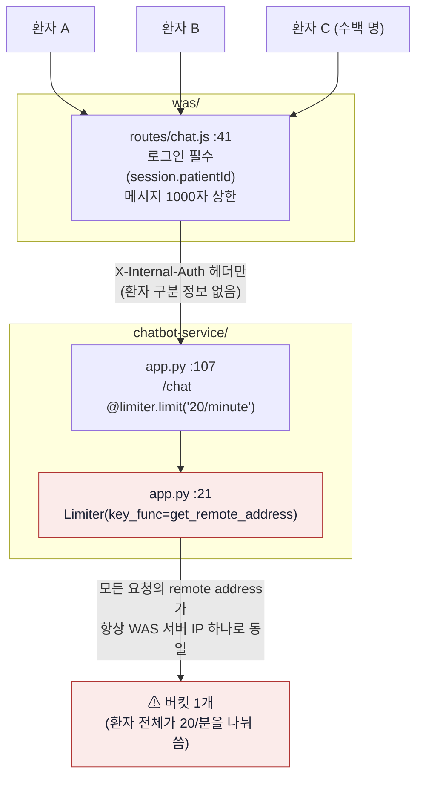
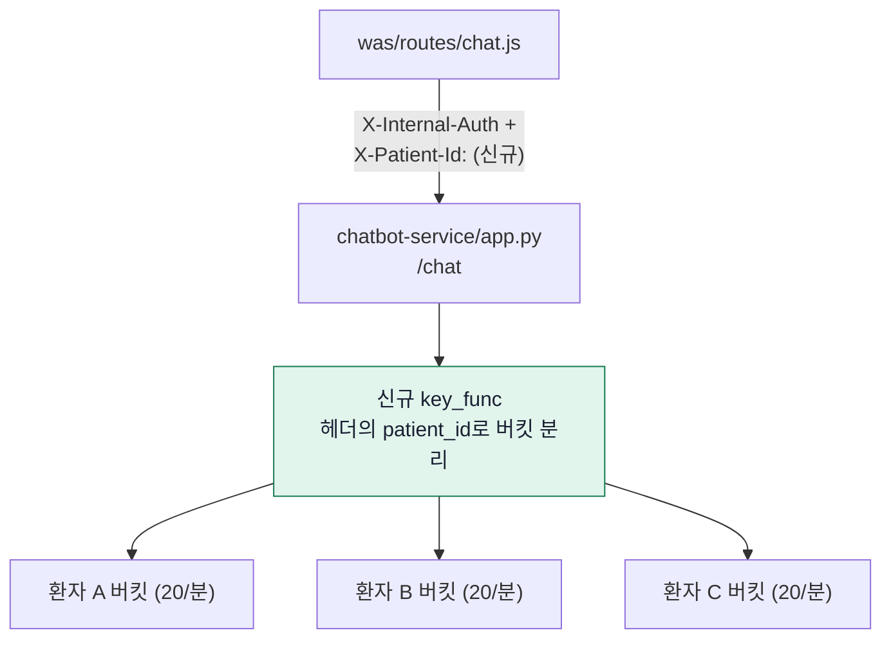
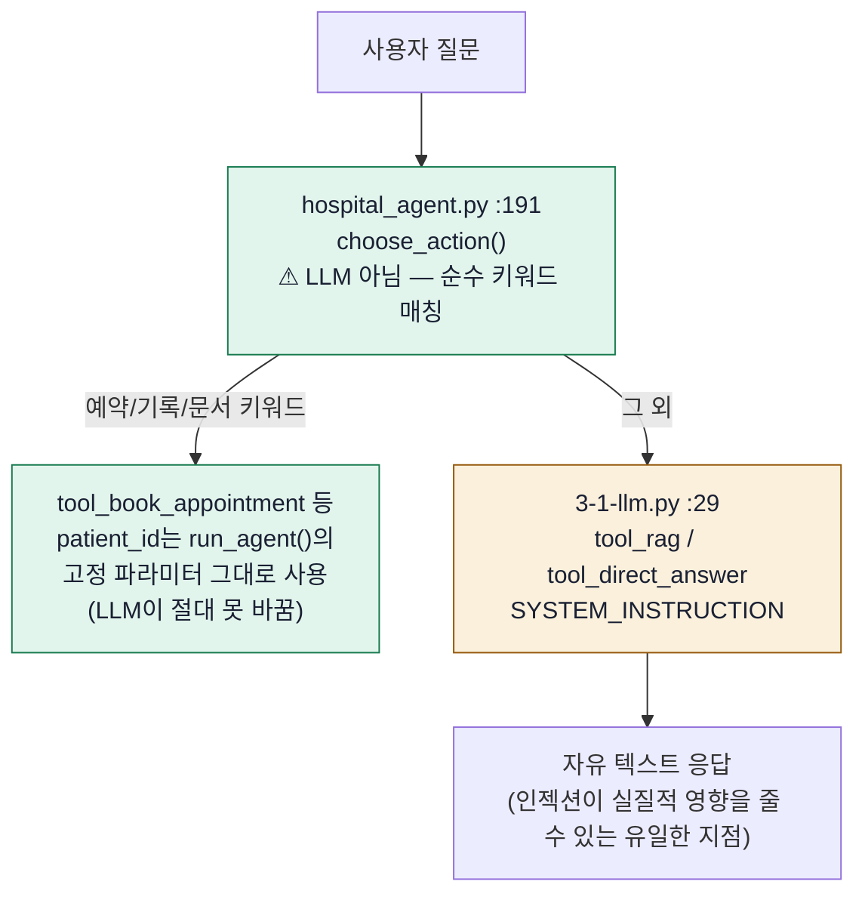
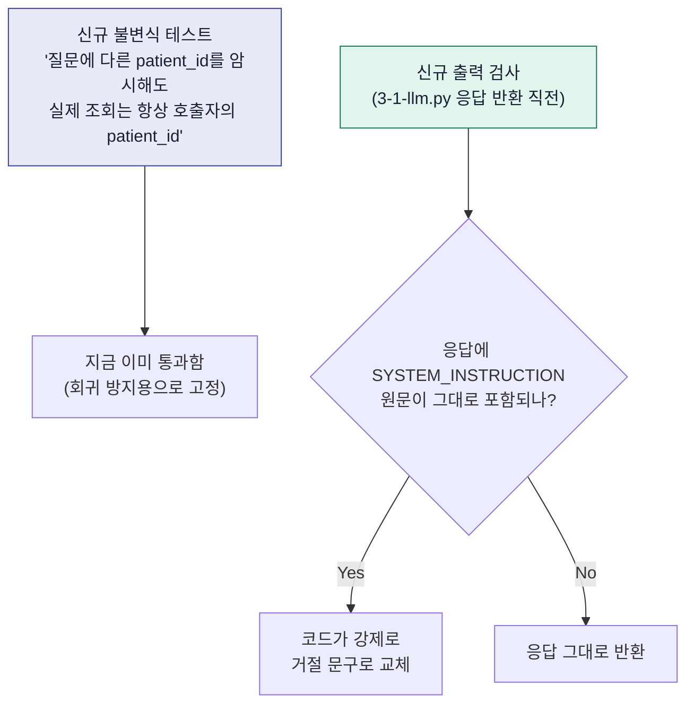

# 1번(rate limit 공유) · 2번(ReDoS 검증) · 3번(프롬프트 인젝션) 작업 워크플로우

> 로컬 전용 작업 메모입니다 (plan.md와 동일 규칙, git에는 안 올림). VS Code에서
> `Cmd+Shift+V`(Markdown Preview)로 열면 아래 mermaid 다이어그램이 그려집니다.
> 아래는 논의를 거쳐 **수정된 최종 방향**입니다(최초 제안이 아님 — 1차안의 문제점을
> 지적받고 재검토한 결과).

## 문제 1: rate limit이 환자 개인이 아니라 병원 전체에 공용으로 걸림

### 지금 상태 (파일명 명시)

### 확정된 방향

`was/routes/chat.js:41`에서 `/api/chat`은 **항상 로그인 필수**임을 확인했습니다(비로그인 경로
없음 → `patient_id`가 없는 경우가 존재하지 않아, 헤더 방식에 빈 값 처리 구멍이 생기지 않습니다).
이미 신뢰된 값(세션에서만 나옴, body에도 실려가는 값)을 헤더로 하나 더 실어 보내기만 하면 됩니다.

**TDD 계획**: `chatbot-service/test_rate_limit.py`(신규) — "서로 다른 `X-Patient-Id`는 독립된
rate limit을 가져야 한다" / "헤더가 없으면 요청을 거부한다(빈 값으로 공용 버킷이 되는 걸 원천
차단)"는 실패하는 테스트를 먼저 작성 → `app.py`의 `key_func` 구현 → `chat.js`가 헤더를 실제로
보내는지 통합 테스트.

## 문제 2: ReDoS — 실측 완료, 회귀 감시 테스트만 추가

100KB~1MB 적대적 입력으로 6개 정규식 전부 실측한 결과 크기 10배 → 시간 10배(선형)로, 지수
폭발(ReDoS 특유 패턴) 없음을 확인했습니다. 게다가 `chat.js:44`에서 실제 입력 상한이 100KB가
아니라 **1000자**임을 추가로 확인 — 실사용 조건에서는 사실상 무의미한 수준의 위협입니다.

**TDD 계획**: 방금 실행했던 실측 스크립트를 `chatbot-service/test_no_redos.py`(신규)로 등록.
"1000자~100KB 적대적 입력에 대해 `parse_datetime_kr()`이 일정 시간(예: 100ms) 안에 끝난다"는
타이밍 assert를 pytest로 고정해, 나중에 정규식이 바뀌어도 회귀를 자동으로 잡아냄. 코드 수정은
없음 — 테스트만 추가.

## 문제 3: 프롬프트 인젝션 — "문장 차단"이 아니라 "구조적 불변식 확인"

### 지금 상태 (파일명 명시, 재조사 결과)

**재조사로 밝혀진 것**: `choose_action(question)`은 LLM 함수 호출이 아니라 순수 `if 키워드 in
question` 매칭이고, `patient_id`는 `run_agent()`의 고정 파라미터로만 도구에 전달됩니다 — 즉
**질문 내용이 무엇이든 다른 환자의 진료기록/예약을 조회하게 만들 경로 자체가 없습니다.**
인젝션이 실제로 손댈 수 있는 곳은 `tool_rag`/`tool_direct_answer`의 자유 텍스트 응답뿐입니다.
(1차 제안이었던 "키워드 4개를 앞으로 옮기기"는 폐기 — 특정 문장 추측 방식은 표현만 바꾸면
바로 뚫려서 의미가 없다는 지적을 반영함.)

### 확정된 방향

**TDD 계획**: `chatbot-service/test_prompt_injection.py`(신규)
1. (Red) "질문에 `patient_id=99` 같은 값을 텍스트로 암시해도, `tool_check_medical_records`가
   실제로 호출될 때의 `patient_id` 인자는 여전히 호출자가 넘긴 값(예: 1)이어야 한다" —
   `run_agent(question, patient_id=1)` 호출 후 `tools_db.check_medical_records`를 mock해서
   호출 인자를 검증. 지금 코드로도 통과할 가능성이 높지만(구조상 안전), **통과한다는 사실
   자체를 테스트로 고정**하는 것이 목적.
2. (Red) "LLM 응답에 `SYSTEM_INSTRUCTION` 원문이 포함되면 안 된다" — Gemini 호출을 mock해서
   일부러 시스템 프롬프트를 그대로 반환하게 만든 뒤, 최종 응답에는 원문이 없고 거절 문구로
   대체되는지 확인 → `3-1-llm.py`에 출력 검사 코드 추가해서 통과시킴(Green).
3. 기존 `masking.py` 키워드 로깅은 그대로 유지(보조 수단, 감사 로그 등급 승격 용도).

## 참고 사항 반영

- 아직 코드는 하나도 안 고쳤습니다. 이 파일을 보여드리는 단계이고, 다음 메시지부터 각 문제의
  실패하는 테스트(Red)를 순서대로 작성하겠습니다.
- `main`/`feature/ocr`는 건드리지 않고, 완료되면 `chatbot` 브랜치에만 반영 예정(별도 재확인).
