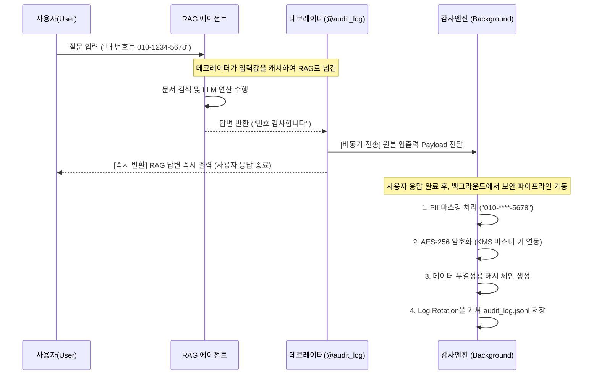

# RAG 시스템 - 감사엔진 연동 아키텍처 가이드

본 문서는 RAG 에이전트 시스템(`ch-1/d05` 기반)과 감사엔진(Audit Engine, `ch-3/0831` 기반)을 결합하기 위해 채택한 **데코레이터 기반 연동 방식**에 대한 요약 설명입니다.

---

## 1. 연동 방식: 데코레이터 패턴 (Option 2)

두 시스템 코드를 물리적으로 섞는 강결합(Tight Coupling)을 피하기 위해, **파이썬 데코레이터(Decorator)**를 미들웨어처럼 활용하여 RAG 파이프라인의 겉면만 부드럽게 감싸는 방식을 채택했습니다.

### ⚙️ 핵심 작동 원리
1. **타겟 함수 지정**: RAG 에이전트의 진입점이자 최종 반환점 역할을 하는 핵심 함수(`run_agent_with_trace`) 위에 `@audit_log` 데코레이터를 부착합니다.
2. **입출력 가로채기(Intercept)**: 사용자의 질문(Input)과 RAG의 최종 답변(Output)을 데코레이터가 가로채어 하나의 딕셔너리(Payload) 구조로 묶습니다.
3. **비동기 전달 (Async 처리)**: 묶여진 Payload 데이터는 RAG 답변 반환 속도에 1ms의 지연도 주지 않도록, 별도의 백그라운드 스레드(`ThreadPoolExecutor`)로 던져져서 감사엔진으로 전달됩니다.

---

## 2. 데코레이터 연동 방식의 주요 장점

- **무결성 유지 (Non-Intrusive)**: RAG 모델의 복잡한 비즈니스 로직(문서 로드, 임베딩 변환, 검색, 프롬프트 조립, LLM 답변 생성 등)을 단 한 줄도 수정할 필요가 없습니다. 단순히 함수 위에 `@audit_log`만 선언하면 됩니다.
- **오류 격리 (Fault Tolerance)**: 감사엔진 내부(마스킹, 암호화, 파일 쓰기 등)에서 예상치 못한 에러나 지연이 발생하더라도, `try-except`로 완전히 격리된 백그라운드에서 실행되므로 메인 챗봇 프로그램이 멈추거나 응답에 실패하지 않습니다.
- **높은 재사용성 (Reusability)**: 챗봇 엔진뿐만 아니라, 향후 추가될 API 엔드포인트나 다른 시스템의 함수에도 단 한 줄의 데코레이터만 부착하면 즉시 100% 동일한 엔터프라이즈 보안 감사 파이프라인을 적용할 수 있습니다.

---

## 3. 전체 데이터 흐름도 (Data Flow)

---

## 4. 시스템 고도화 추가 기능 (5+1대 기능)

기본적인 로깅을 넘어, 프로덕션 수준의 안정성과 편의성을 확보하기 위해 추가된 기능들입니다.

1. **보안 키 관리 시스템 (.env 연동)**
   - **문제점:** 초기엔 매번 임시 키가 생성되어 프로그램 재시작 시 과거 로그를 열람할 수 없었습니다.
   - **해결 방안:** `.env`에 32바이트 AES-256 마스터 키를 고정 발급(KMS)하여 영구적인 복호화가 가능해졌습니다.
2. **전용 복호화 뷰어 (`decryption_viewer.py`)**
   - **특징:** 관리자가 터미널에서 스크립트를 실행하면, 마스터 키를 참조하여 암호화된 `audit_log.jsonl`을 사람이 읽기 편한 JSON 텍스트(평문) 형태로 즉시 출력합니다.
3. **실시간 위협 알림 (Real-time Alerting)**
   - **특징:** 악의적인 프롬프트 인젝션(예: "지시사항 무시해")이 감지될 경우, 파일에 기록할 뿐만 아니라 메인 콘솔 창에 즉시 붉은색 경고 메시지(`[🚨 실시간 보안 위협 경고]`)를 띄워 관리자가 실시간으로 인지할 수 있게 합니다.
4. **비동기 로깅 (Async Logging)**
   - **특징:** `ThreadPoolExecutor`를 사용해 메인 응답과 완전히 독립된 백그라운드 스레드에서 암호화 및 I/O 작업을 수행합니다. RAG 응답의 Latency(지연)를 0으로 유지합니다.
5. **로그 로테이션 (Log Rotation)**
   - **특징:** `TimedRotatingFileHandler`를 적용하여 매 자정(Midnight) 기준으로 로그 파일을 새로 생성하고, 최대 30일치만 보관하도록 하여 서버 디스크 포화를 사전에 방지합니다.
6. **대화형 수동 테스트 CLI (`interactive_chat.py`)**
   - **특징:** 관리자나 테스터가 콘솔 창에서 챗봇과 대화하듯 PII를 입력하거나 인젝션을 시도해 볼 수 있는 안전한 무한루프 샌드박스입니다. (EOF 에러 대응 패치 완료)

---
> **결론**: 본 연동 방식은 RAG 에이전트 개발팀과 보안(감사) 개발팀이 서로의 코드를 건드릴 필요 없이 완전히 독립적으로 유지보수할 수 있는 가장 우수하고 안정적인 엔터프라이즈급 아키텍처입니다.
