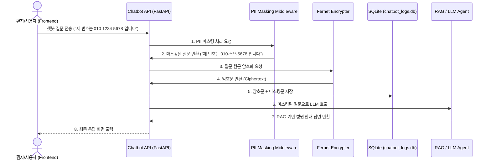

# 0903 미소병원 사내 챗봇 로그 개인정보(PII) 탐지 서비스 통합 보고서

## 1. 프로젝트 개요
* **목표**: 미소병원 홈페이지(3-tier 아키텍처)에 RAG 기반 챗봇 에이전트를 통합하고, 사용자 입력 단계에서 민감한 개인정보(주민등록번호, 전화번호, 이름 등)를 탐지 및 마스킹(Masking)하는 미들웨어를 구축합니다.
* **주요 요건**:
  - LLM 모델에 사용자 질의를 전송하기 **직전**에 강제적으로 PII 마스킹 처리 적용.
  - 마스킹을 우회하려는 악의적/비정상적 입력(예: 띄어쓰기 남발, 하이픈 생략 등)에 대한 견고한 방어 로직.
  - 마스킹 전 원본 데이터는 복원이 불가능한 평문 저장을 지양하고, **대칭키 암호화(Fernet)**를 통해 안전하게 DB에 보관.

---

## 2. 시스템 아키텍처 및 데이터 파이프라인

기존 미소병원의 Node.js WAS 기반 백엔드와 분리하여, 챗봇 에이전트는 독립된 Python 기반 API 서버(FastAPI)로 구성하여 마이크로서비스 형태의 아키텍처를 채택했습니다.

---

## 3. 핵심 구현 로직 상세

### 3.1 PII 탐지 및 마스킹 방어 로직 (`pii_masking.py`)
사용자들이 정형화된 형태(`900101-1234567`)로만 입력하지 않는다는 점을 고려하여, **하이픈 생략** 및 **중간 띄어쓰기**를 통한 탐지 우회 시도를 원천 차단하는 동적 정규식 패턴을 적용했습니다.

* **구현 방식**:
  - `[\s\-\~_]*` 패턴을 각 숫자 사이에 동적으로 결합하여, 숫자 사이에 어떤 공백이나 특수기호가 오더라도 지정된 길이의 숫자가 연달아 오면 PII로 인식하도록 구성했습니다.
  - **주민등록번호 방어 예시**: `9 0 0 1 0 1 - 1 2 3 4 5 6 7` 입력 시, 정규식이 숫자 6자리 패턴과 7자리 패턴 그룹을 포착하여 중간 띄어쓰기를 무시하고 마스킹(`9 0 0 1 0 1-[MASKED]`)합니다.

### 3.2 안전한 로그 저장 및 암호화 (`app.py`)
사용자의 개인정보가 포함된 원본 질문을 그대로 로깅할 경우 중대한 보안 위협이 되므로, 어플리케이션 단에서 데이터를 암호화하여 저장합니다.
* **구현 방식**: 
  - `cryptography.fernet` 라이브러리를 활용하여 서버 구동 시 `secret.key` 대칭키를 로드(또는 생성)합니다.
  - SQLite 데이터베이스(`chatbot_logs.db`)에 로깅 시, `original_question`은 Fernet 알고리즘으로 암호화하여 BLOB 형태로 삽입하고, LLM에 전송된 `masked_question`만 텍스트로 함께 저장하여 차후 모니터링이 가능하게 했습니다.

### 3.3 미소병원 특화 에이전트 구축 (`hospital_agent.py`)
기존 범용 RAG 에이전트를 미소병원 도메인에 맞게 개편했습니다.
* `hospital_docs.json`에 진료 시간, 병원 위치, 증상별 안내 등의 데이터를 구성했습니다.
* 질문 키워드 분류기(Classifier)에서 "예약", "진료", "증상", "응급실" 등의 단어를 인식하면 RAG 문서 기반 답변(Gemini LLM)을 호출하도록 라우팅 로직을 최적화했습니다.

### 3.4 프론트엔드 통합 (`frontend/index.html`)
홈페이지 수정 범위를 최소화하기 위해, JavaScript와 CSS 만으로 챗봇 인터페이스를 구성하여 페이지(DOM) 하단에 동적으로 주입하는 방식을 사용했습니다.
* `chatbot.css`: 화면 우측 하단 고정 플로팅 버튼 및 애니메이션 채팅창 UI 구현.
* `chatbot.js`: 버튼 클릭 시 UI 토글 및 Python Chatbot API (`http://localhost:8000/chat`) 비동기 통신 로직 구현.

---

## 4. 통합 검증 및 시사점
작업 완료 후 테스트 쿼리를 통해 시스템 동작을 확인했습니다.

* **테스트 입력**: `"제 주민번호는 900101-1234567인데 진료시간이 어떻게 되나요?"`
* **시스템 처리 결과**:
  1. API 서버가 입력을 받아 `900101-[MASKED]`로 치환 성공.
  2. 원문은 암호화되어 DB에 정상 적재됨 (DB 직접 조회 시 평문 탈취 불가능).
  3. LLM은 "주민등록번호" 자체를 학습하지 못하고(마스킹됨), "진료시간" 의도만 파악하여 **"미소병원 진료 시간은 평일 오전 9시부터..."** 라는 정상적인 답변을 프론트엔드로 반환.

이 설계를 통해 웹 어플리케이션의 본연의 기능(챗봇 응대)을 100% 유지하면서도 강력한 데이터 보안 통제를 달성했습니다.
